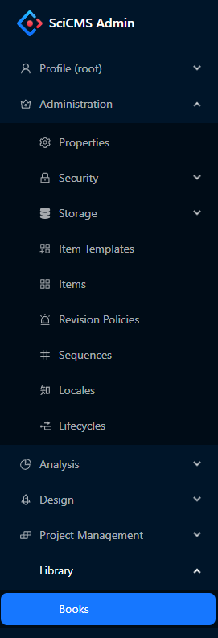

# SciCMS Client

Клиентское веб-приложение для headless-системы управления контентом [SciCMS Core](https://github.com/borisblack/scicms-core).

Изначально система создавалась как интеграционная основа для управления данными из различных источников на промышленных предприятиях.
В SciCMS (сокр. от Scientific CMS) сделан упор на сопровождение высокотехнологичных производств.
В таких производствах жизненный цикл изделий отличается большим объемом данных, имеющих сложную многоуровневую структуру.
Дополнительно предъявляется ряд требований по версионированию и мультиязычности записей, а также возможности консолидации данных из различных источников.
На развитие системы повлияли такие проекты, как [Aras Innovator](https://aras.com) и [Strapi](https://strapi.io).

## Основные возможности системы

- простое и гибкое управление хранимыми структурами данных;
- широкий набор типов данных;
- поддержка версионирования данных;
- поддержка мультиязычности;
- поддержка нескольких источников данных;
- поддержка связей между хранимыми сущностями (один-к-одному, многие-к-одному, один-ко-многим, многие-ко-многим);
- контроль доступа на уровне записей;
- механизм блокировки записей от изменения другими пользователями;
- аутентификация пользователей локально и по протоколу OAuth2;
- поддержка хранения файлов как в локальной файловой системе, так и в S3;
- хуки жизненного цикла хранимых сущностей;
- инструменты для построения аналитической отчетности;
- расширяемость интерфейса и бизнес-логики приложения за счет подключаемых модулей.

## Начало работы

Перед началом работы рекомендуется ознакомиться с документацией сервера [SciCMS Core](https://github.com/borisblack/scicms-core).

### Запуск

SciCMS Client представляет собой React-приложение, написанное на Typescript. Для сборки используется среда [Create React App](https://create-react-app.dev).
В качестве UI фреймворка выбран [Ant Design](https://ant.design).

Перед первым запуском необходимо установить зависимости командой `yarn install` (в рабочей директории проекта).

Доступны следующие команды:
- `yarn start-rewired` - локальный запуск; приложение будет открыто в браузере по адресу [http://localhost:3000](http://localhost:3000); при внесении изменений в исход код страница автоматически перезагрузится; ошибки и предупреждения линтера будут отображаться в терминале;
- `yarn test` - запуск тестов;
- `yarn build` - сборка оптимизированного бандла для промышленной эксплуатации.

### Вход

Форма входа имеет две вкладки: `Система` и `OAuth2`. Первая используется для входа с локальной учетной записью, вторая - с использованием протокола OAuth2.



Первый вход может быть выполнен с локальной учетной записью `root` и паролем `master`.
Эта административная учетная запись создается на сервере SciCMS Core автоматически при первом запуске.
Для входа с использованием протокола OAuth2 предварительно необходимо выполнить [настройки на сервере](https://github.com/borisblack/scicms-core/blob/main/docs/ru/security.md "Безопасность").

### Основные настройки

Конфигурационные файлы приложения находятся в папке [src/config](src/config). Основные настройки программы - это URL сервера SciCMS Core и язык интерфейса.
Наиболее простой (и рекомендуемый) способ их изменения: использование переменных окружения:
- `REACT_APP_CORE_URL` - URL сервера SciCMS Core (значение по умолчанию - `http://localhost:8079`, соответствует локально запущенному экземпляру сервера);
- `REACT_APP_I18N_LNG` - язык интерфейса (значение по умолчанию - `en-US`); в настоящий момент доступны значения: `en-US` и `ru-RU`.

Переменные могут быть заданы в `.env` файлах для различных окружений, подробнее см. в [документации](https://create-react-app.dev/docs/adding-custom-environment-variables).

Другие настройки могут быть заданы непосредственно в конфигурационных файлах в директории [src/config](src/config).

### Локализация

Файлы локализации приложения находятся в каталогах [src/i18n](src/i18n) и [src/i18n/custom](src/i18n/custom).
В настоящий момент реализованы локализации для английского и русского языков.

### Операции с сущностями

Центральным понятием в SciCMS является **сущность** (Item).
В аналогии с объектно-ориентированным программированием сущность представляет собой класс (описание полей и методов), а запись для данной сущности - экземпляр класса (конкретные данные). Подробнее о сущностях и модели данных SciCMS см. в [документации SciCMS Core](https://github.com/borisblack/scicms-core/blob/main/docs/ru/data_model.md "Модель данных").

Для работы с сущностями необходимо выбрать пункт меню **Администрирование/Сущности**, откроется вкладка со списком имеющихся сущностей.
Для создания сущности необходимо во вкладке со спискам сущностей нажать кнопку **Создать**.
Например, для создания сущности `book` в форме редактирования требуется заполнить поля **имя**, **имя (мн. ч)**, **имя таблицы** и добавить атрибуты `name` и `rating`:


Подробнее об атрибутах сущностей см. в разделе [Управление сущностями](/docs/ru/item_management.md).
После нажатия кнопки **Сохранить** необходимо выполнить повторный вход в приложение (будет выведено соответствующее диалоговое окно с предложением).

Для просмотра и редактирования сущности нужно на вкладке со списком дважды щелчнуть на выбранной строке.
Редактирование производится в три этапа: блокировка нажатием кнопки **Изменить**, собственно редактирование, и разблокировка нажатием кнопки **Сохранить**.
Это поведение установлено для всех сущностей в системе по умолчанию и может быть изменено, если на форме редактирования сущности включить флаг **Откл. блокировку**.
В этом случае будет только кнопка **Сохранить** и поля формы всегда будут доступны для изменения. Редактирование системных сущностей (с флагом `core` = `true`) запрещено.

Удаление можно производить либо из формы редактирования, либо на вкладке со списком через вызов контекстное меню сущности.

### Работа с табличным списком

Списки в SciCMS имеют инструменты для фильтрации, сортировки и пагинации. В верхней части таблицы находится строка с фильтрами для каждого столбца.
Фильтры объединяются по условию **И**. Принцип работы фильтров зависит от типа столбца:
- для строковых типов ищется частичное соответствие без учета регистра;
- для числовых типов производится буквальное сравнение;
- для булевого типа допустимые значения фильтра: `1`, `0`, `true`, `false`, `yes`, `no`, `y`, `n`;
- фильтр для типа `date` может принимать следующие форматы: `31.12.2023`, `2023-12-31` (фильтр по диапазону в 1 день); `12.2023`, `2023-12` (фильтр по диапазону в 1 месяц); `2023` (фильтр по диапазону в 1 год);
- фильтр для типа `time` может принимать следующие форматы: `23:59` (фильтр по диапазону в 1 минуту); `23` (фильтр по диапазону в 1 час);
- фильтр для типа `datetime` и `timestamp` может принимать следующие форматы: `31.12.2023 23:59`, `2023-12-31 23:59` (фильтр по диапазону в 1 минуту); `31.12.2023 23`, `2023-12-31 23` (фильтр по диапазону в 1 час); `31.12.2023`, `2023-12-31` (фильтр по диапазону в 1 день); `12.2023`, `2023-12` (фильтр по диапазону в 1 месяц); `2023` (фильтр по диапазону в 1 год);
- для связи типа `oneToOne` и `manyToOne` ищется частичное соответствие для титульного атрибута без учета регистра; титульный атрибут задается в поле `titleAttribute` сущности (если не задан, то используется идентификатор).

## Меню приложения

Для работы с вновь созданными сущностями необходимо добавить из в меню приложея.
Для этого нужно либо отредактировать файл [src/config/menu.ts](src/config/menu.ts), либо добавить параметр конфигурации `menu` с типом `json` и аналогичным значением в виде JSON-объекта.
Управление параметрами конфигурации выполняется из меню **Администрирование/Параметры**.
Объект конфигурации меню с новыми категорией и сущностью `book` представлен ниже.
Каждый элемент списка `items` является либо выбираемым пунктом меню, либо категорией.
```javascript
const menuConfig: MenuConfig = {
  items: [{
    key: 'administration',
    label: 'Administration',
    icon: 'CrownOutlined',
    roles: [ROLE_ADMIN],
    children: [{
      itemName: 'property'
    }, {
      key: 'security',
      label: 'Security',
      icon: 'LockOutlined',
      roles: [ROLE_ADMIN],
      children: [{
        itemName: 'group'
      }, {
        itemName: 'user'
      }, {
        itemName: 'permission'
      }, {
        itemName: 'identity'
      }]
    }, {
      key: 'storage',
      label: 'Storage',
      icon: 'FaDatabase',
      roles: [ROLE_ADMIN],
      children: [{
        itemName: 'datasource'
      }, {
        itemName: 'media'
      }]
    }, {
      itemName: 'itemTemplate'
    }, {
      itemName: 'item'
    }]
  }, {
    key: 'analysis',
    label: 'Analysis',
    icon: 'PieChartOutlined',
    roles: [ROLE_ADMIN, ROLE_ANALYST],
    children: [{
      itemName: 'dataset'
    }, {
      itemName: 'dashboard'
    }, {
      itemName: 'dashboardCategory'
    }]
  }, {
    key: 'library',
    label: 'Library',
    children: [{
      itemName: 'book'
    }]
  }]
}
```

Выбираемый пункт меню содержит единственное поле `itemName` - имя сущности.
Действие при клике на пункте меню - открытие вкладки со списком записей для указанной сущности.
Содержимое страницы списка (как и многих других) также может быть переопределено через механизм [расширений](docs/ru/extensions.md).

Категория меню содержит следующие поля:
- `key` - уникальный строковый ключ категории;
- `label` - отоброжаемое имя категории (локализованная строка);
- `icon` - значок категории (необязательное поле);
- `roles` - роли, для которых доступна категория; подробнее о ролях см. в [документации SciCMS Core](https://github.com/borisblack/scicms-core/blob/main/docs/ru/security.md "Безопасность");
- `children` - дочерние категории/пункты.

После сохранения меню и обновления страницы оно должно выглядеть следующим образом:


При выборе пункта **Library/Books** откроется список сущностей со стандартным набором операций.

## Дополнительные ресурсы

[Управление сущностями](docs/ru/item_management.md)

[Безопасность](docs/ru/security.md)

[Жизненный цикл сущностей](docs/ru/lifecycle.md)

[Расширения](docs/ru/extensions.md)

[Инструменты аналитики](docs/ru/analytics.md)
