# Analytics tools

## Datasources

To work with third-party databases, we need to configure the appropriate datasources.
Creating datasources is described in the [Items Management](item_management.md) section.

## Datasets

In SciCMS, a dataset corresponds to a table or arbitrary SQL query in a data source.
The menu item for managing datasets is **Analysis/Datasets**.

### Creating a dataset

When creating a dataset, we need to select the previously created data source, or the default data source `main` will be used.
Just like the Item, the dataset has an optional parameter **cache TTL (min)** - cache lifetime in minutes.
If it is not set, then the default value is 5 minutes (customizable parameter - see [SciCMS Core documentation](https://github.com/borisblack/scicms-core/blob/main/docs/analytics.md "Analytics tools") for more details).
If the cache value is less than or equal to 0, then records in the dataset are not cached. The cache is reset every time the application is restarted.

To work with a dataset, we need to know what tables are contained in the datasource, what the structure of these tables is and what records they contain.
To obtain this information, use the following tabs: **Sources** and **Fields** at the bottom of the dataset form.

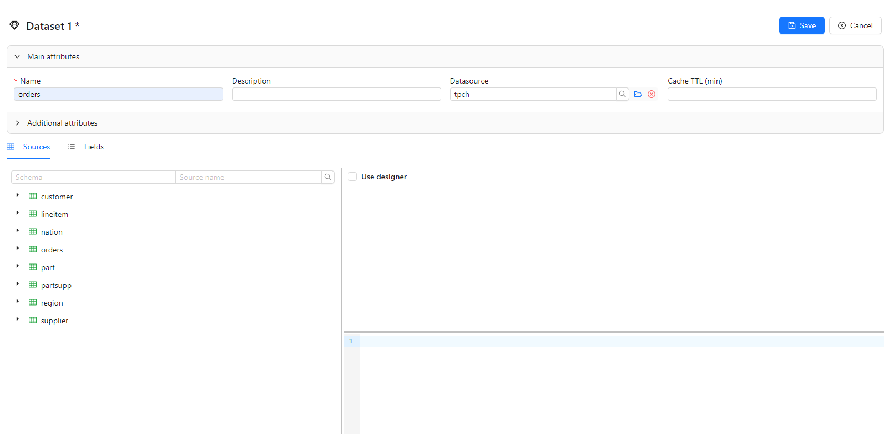

### Source management

The left side of the **Sources** tab contains a list of tables and columns in a tree view.
Here and below, the examples use a data source based on the [TPC-H](https://www.tpc.org/tpch) schema - a database designed for testing the performance of SQL queries.
Above the list there is a filter by schema and table name. By default, all tables in the user's current schema are displayed.
Table searches are based on partial matches and are not case sensitive.
To correctly display the list of tables, it is necessary that the user specified in the datasource has rights to obtain information about the structure of the database.

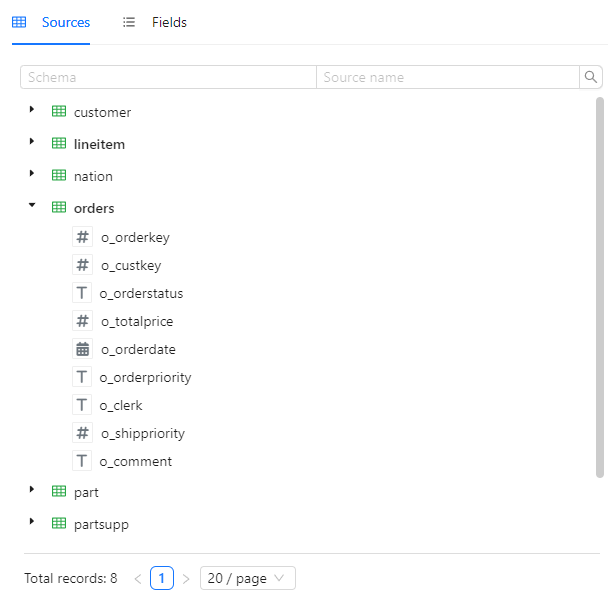

The right side of the **Sources** tab is divided into two parts: at the top is the design area (activated by the **Use designer** checkbox), at the bottom is the SQL query editor (read-only when using the designer).
If we activate the designer, then when we drag tables into its area, the query will be built dynamically.
The first table added will be the main table to which others can also be added by dragging and dropping (in this case a `JOIN` statement is generated).

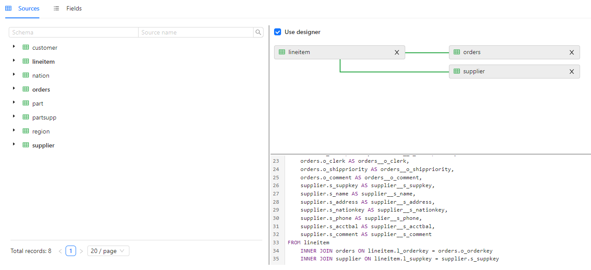

To select join parameters, click on the line between the tables.

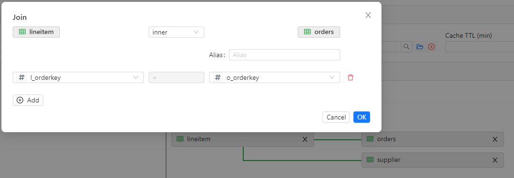

If necessary, you can disable the designer and enter the SQL query manually.

### Setting up fields

The **Fields** tab is divided horizontally into two parts: at the top there is a list of source fields, at the bottom there is data from the source.

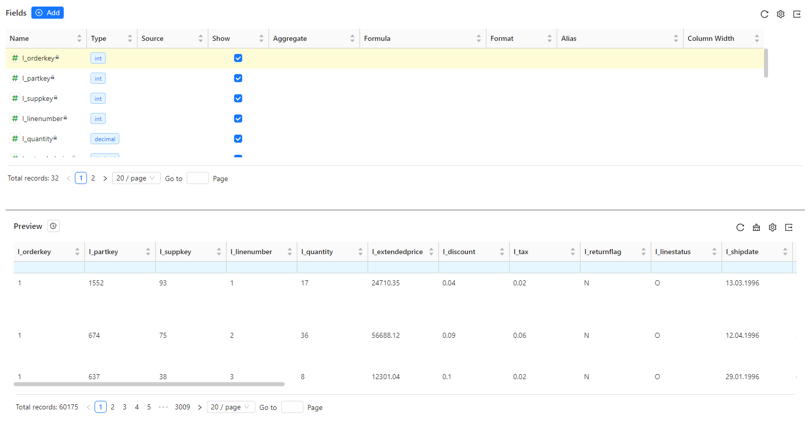

Each field has the following properties:
- **Name** - field name;
- **Type** - field type (for more information about types, see [SciCMS Core documentation](https://github.com/borisblack/scicms-core/blob/main/docs/ru/analytics.md "Analytics tools "));
- **Source** - the name of the real field if the field is custom (see below) and the **Formula** property is not set;
- **Show** - some columns may be excluded from the query; in this case, this flag is removed;
- **Aggregate** - the name of the aggregate function, can take the values ​​`count`, `countd`, `sum`, `avg`, `min`, `max`; only applies to custom fields;
- **Formula** - arbitrary SQL expression for performing more complex aggregations;
- **Format** - field value format to be displayed in reports; can take values ​​`int`, `float`, `date`, `time`, `datetime`;
- **Alias** - alias of the field to be displayed in reports;
- **Column Width** - column width to be displayed in reports.

Fields whose names are marked with a lock icon are native fields of the data source and cannot be edited (with the exception of the **Show**, **Format**, **Alias**, and **Column Width** properties).
These properties can be edited directly in the field list.

#### Custom fields

A dataset can contain so-called custom (virtual) fields, which are used when constructing analytical queries.
Custom fields are created by clicking the **Add** button above the list of fields. This opens a modal window for editing the field.
A similar window opens when we click on the properties **Name**, **Source**, **Aggregate** and **Formula** in the list of fields.

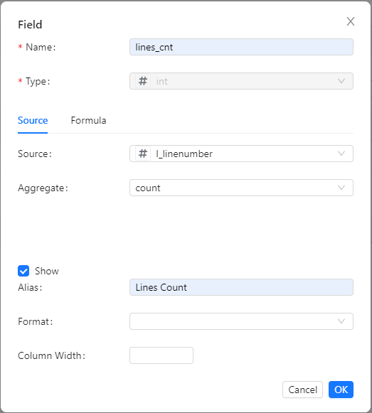

When we add/change fields at the bottom of the **Fields** tab, the report is automatically rebuilt containing the selected fields.
If aggregate functions are used, then grouping occurs only by fields for which the **Show** flag is selected.
Filters and pagination are configured in the same way as any other table lists in the system.

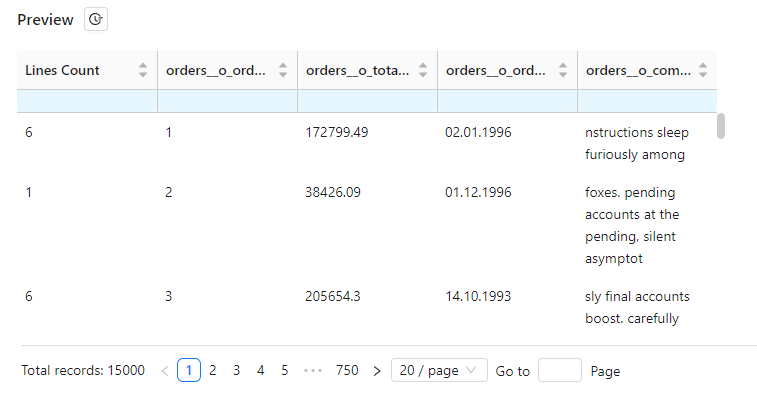

To the right of the **Preview** header there is a button for opening statistics on query execution on the server.

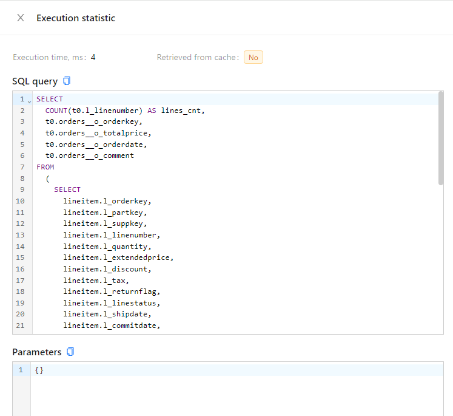

## Dashboards

A dashboard is a set of interactive data visualization elements.
The menu item for managing dashboards is **Analysis/Dashboards**.
The dashboard editing form at the bottom contains two tabs: **Categories** and **Spec**.
On the **Categories** tab, we can select the categories that the dashboard will be included in.

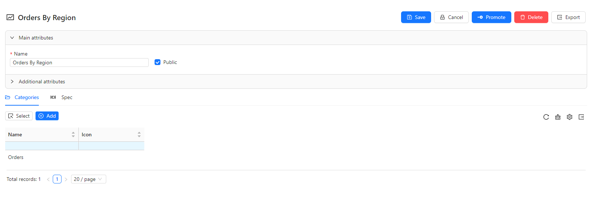

The **Spec** tab contains a dashboard visualization designer.

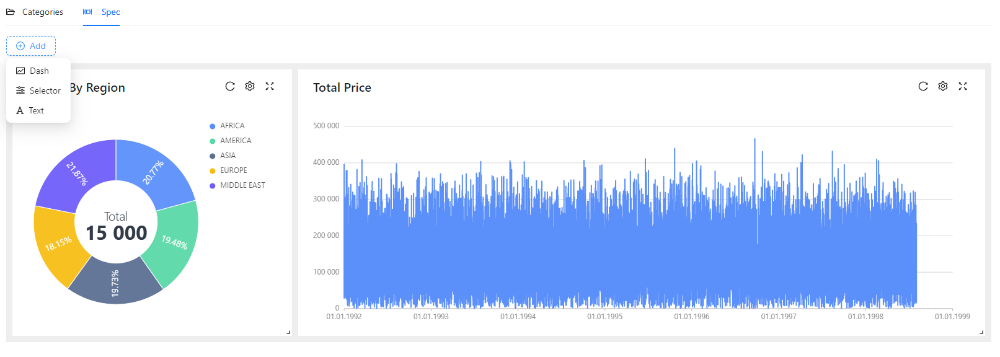

## Dashes

**Dash** is the main element of data visualization on a dashboard.
To add a dash, we need to select the **Dash** item in the **Add** drop-down button.
At the top of each dash on the right there are update buttons, a context menu and expanding the dash to full screen.
The Dash context menu allows us to perform the following actions:
- set temporary filters (which are reset when the dash is closed);
- open query execution statistics;
- open the dash for editing;
- delete dash.

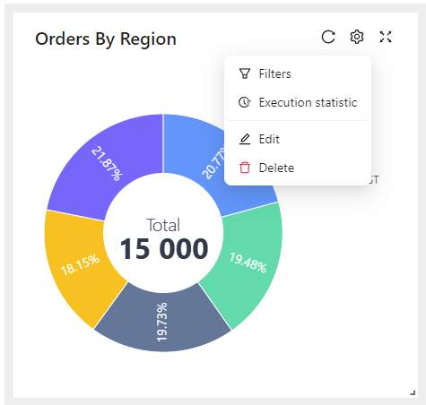

In the editing window, the dataset must be selected, as well as the type and name of the dash.
There are currently 13 types of dashes available:
`area` - line graph with filling;
`bar` - horizontal bar chart;
`bubble` - bubble chart;
`bubbleMap` - bubble chart in the form of a map layer;
`column` - vertical column chart;
`dougnut` - a pie chart with sectors and a customizable (external and internal) radius;
`line` - line graph;
`pie` - a pie chart with sectors and a custom (outer) radius;
`polarArea` - pie chart with sectors in polar coordinates;
`radar` - a pie chart with filling in the form of a radar screen;
`report` - tabular report;
`scatter` - bubble chart;
`statistic` - numeric/text label.

Using the [extensions mechanism](extensions.md), other types of dashes can be added.

Depending on the dash type, fields are assigned specific roles (x-axis, y-axis, series, sort, etc.).
There is also a set of specific (for a specific dash type) properties (location of the legend, auto-rotation of the axis label, etc.).

The field for entering rules for styling records allows us to declaratively describe the appearance of data elements (color, font, icons).
When we hover over the question icon next to the field title, a pop-up window appears with hints on how to use the rules.

Flexible filtering of unlimited nested data is supported.
When we hover over the question icon next to the field title, a pop-up window appears with a hint about the available functions that can be used in the filters.

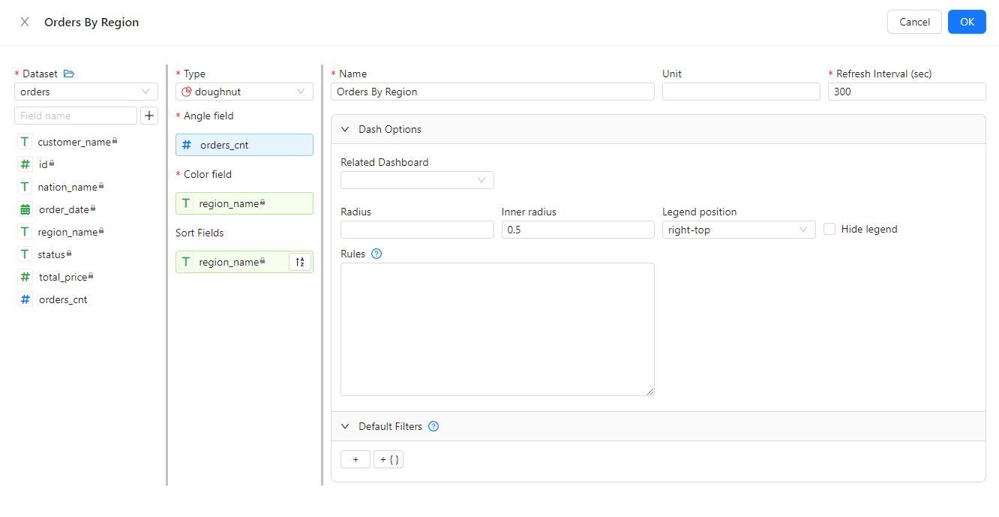

## Text

The **Text** element allows us to add a dash or a group of dashes on the dashboard with one general title or text description.
Editing is performed (similarly to dash) from the context menu.

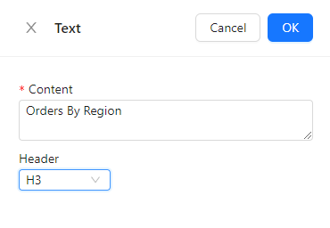

The **Header** parameter (if specified) allows us to select the heading level (H1 - H5).

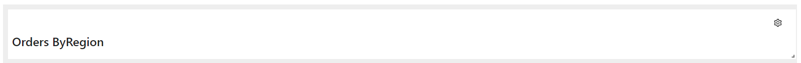

## Selectors

The **Selector** element allows us to specify relationships between dashes on the dashboard.
For example, when selecting a point on a chart, another dash can be filtered by the selected element.
To do this, the selector must be linked to the dataset.
Links can be of three types: `in` - incoming link, `out` - outgoing link and `both` - two-way link.
In addition to links between dashes, ​​the selector itself can act as a filter for dashes associated with it.
Editing is performed (similarly to dash) from the context menu.
Example of selector setup:

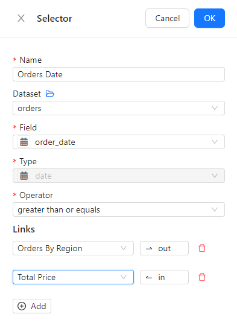

All dashboards for which the user has **Read** permission are available on a separate `/bi` page (for example, when developing locally, the full address will look like this: `http://127.0.0.1:3000/bi`).

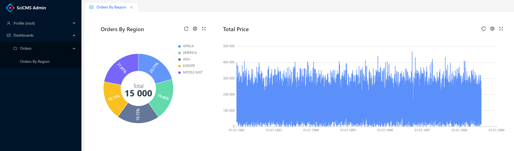