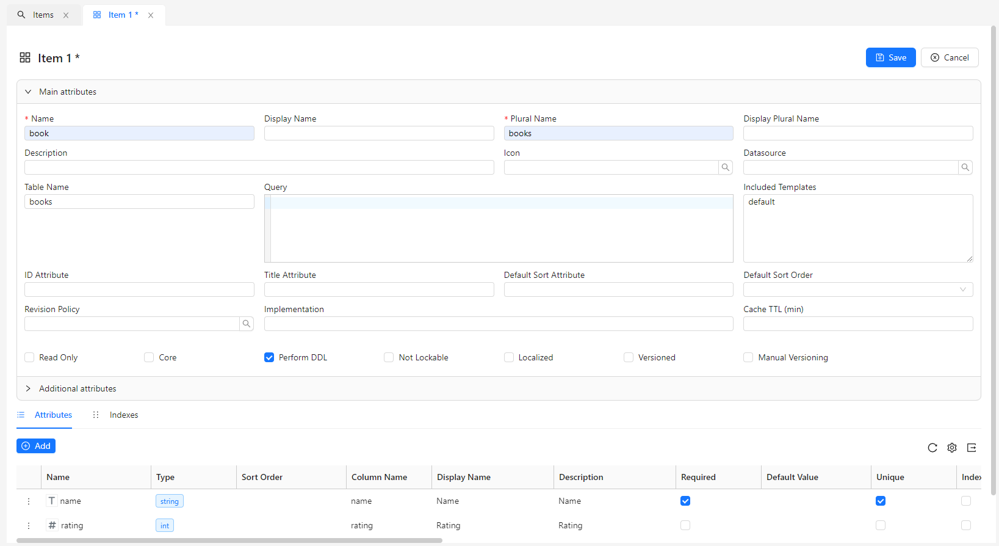
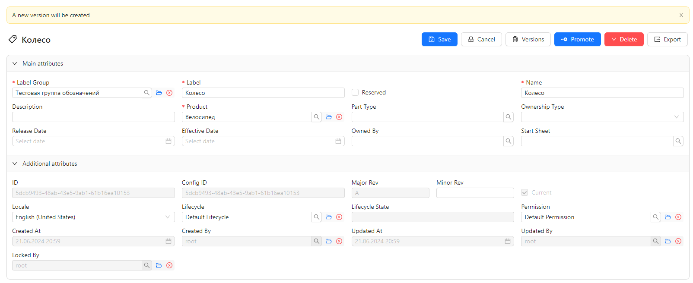
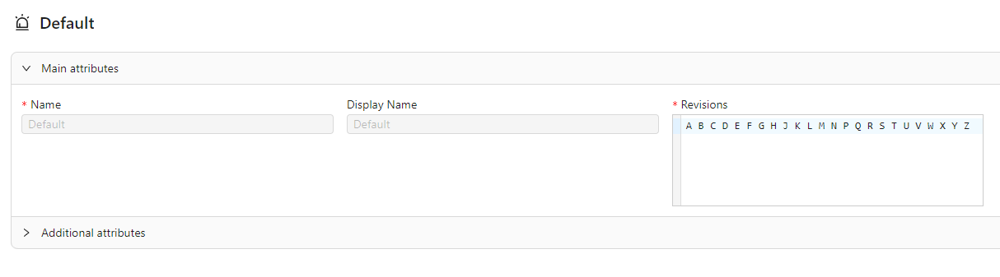
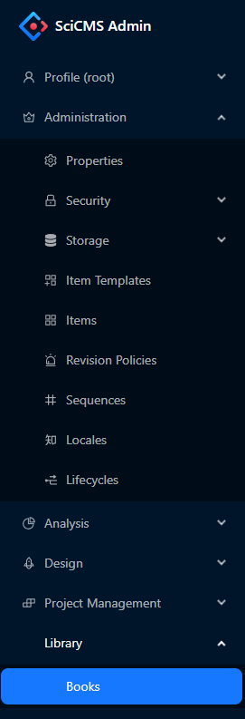
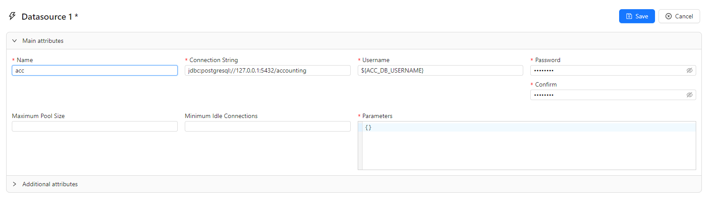

# Items management

The central concept in SciCMS is **Item**.
In the object-oriented programming analogy, an Item is a class (a description of fields and methods), and a record for a given Item is an instance of a class (specific data). For more information about Items and the SciCMS data model, see [SciCMS Core documentation](https://github.com/borisblack/scicms-core/blob/main/docs/data_model.md "Data Model").

## Creating/updating/deleting

To work with Items, we need select the menu item **Administration/Items**, a tab will open with a list of available Items.
To create an Item, in the tab with the list of Items, click the **Create** button.
For example, to create a `book` Item in the edit form, we need to fill in the fields **Name**, **Plural Name**, **Table Name** and add the `name` and `rating` attributes:



Each Item has an optional parameter **Cache TTL (min)** - cache lifetime in minutes.
If it is not set, then the default value is 10 minutes (configurable parameter, for more details see [SciCMS Core documentation](https://github.com/borisblack/scicms-core/blob/main/docs/data_model.md "Data model").
If the cache value is less than or equal to 0, then Item records are not cached.
The cache works only for read operations. When an Item is changed/deleted, the cache is updated.

After clicking the **Save** button, we need re-enter the application (a corresponding dialog box with a suggestion will be displayed).

To view and edit an Item, double-click on the selected line in the list tab.
Editing is carried out in three stages: locking by clicking the **Edit** button, editing itself, and unlocking by clicking the **Save** button.
This behavior is set for all Items in the system by default and can be changed if the **Not Lockable** flag is enabled on the Item edit form.
In this case, there will only be a **Save** button and the form fields will always be available for editing. Updating system Items (with the `core` = `true` flag) is prohibited.

Deleting can be done either from the edit form, or on the tab with the list by calling the context menu of the Item.

## Working with a table list

Lists in SciCMS have tools for filtering, sorting and pagination. At the top of the table there is a row with filters for each column.
Filters are combined according to the **AND** condition. The way filters work depends on the type of column:
- for string types, a partial match is searched without regard to case;
- for numeric types, a literal comparison is made;
- for the Boolean type, valid filter values ​​are: `1`, `0`, `true`, `false`, `yes`, `no`, `y`, `n`;
- the filter for the `date` type can accept the following formats: `31.12.2023`, `2023-12-31` (filter by range of 1 day); `12.2023`, `2023-12` (filter by range of 1 month); `2023` (filter by 1 year range);
- the filter for the `time` type can accept the following formats: `23:59` (filter by range of 1 minute); `23` (filter by 1 hour range);
- the filter for the `datetime` and `timestamp` types can accept the following formats: `31.12.2023 23:59`, `2023-12-31 23:59` (filter by range of 1 minute); `31.12.2023 23`, `2023-12-31 23` (filter by 1 hour range); `31.12.2023`, `2023-12-31` (filter by range of 1 day); `12.2023`, `2023-12` (filter by range of 1 month); `2023` (filter by 1 year range);
- for relationships of type `oneToOne` and `manyToOne`, a partial match is searched for the title attribute, case insensitive; the title attribute is set in the `titleAttribute` field of the Item (if not set, the identifier is used).

## Item attributes

The system supports the following attribute types:
- `uuid` - format string [UUID](https://en.wikipedia.org/wiki/Universally_unique_identifier); in the form it is displayed as a string input field with UUID format validation;
- `string` - fixed-length string; the maximum length is determined by the `length` attribute field; is displayed in the form as a string input field; if additional validation is necessary, we can set the `pattern` parameter - a regular expression that the string must match;
- `text` - string of unlimited length; appears in the form as a multi-line drop-down editor; Additionally, the `format` parameter can be set to highlight the syntax (currently the values ​​`sql` and `javascript` are available);
- `enum` - string enumeration; this attribute requires an `enumSet` field with a list of valid values; appears in the form as a drop-down list of values ​​for selection;
- `sequence` - the attribute value will be taken from the sequence; a sequence is a separate Item and includes attributes such as starting value, prefix, suffix, step, padding, padding length; for an attribute with type `sequence` the parameter `seqName` must be specified, which refers to the name of an existing sequence; in the form it is displayed as a read-only string input field, because the value is generated automatically;
- `email` - email address string; in the form it is displayed as a string input field with address format validation;
- `password` - password string; in addition, the `encode` field can be specified - to encode the string when saving to the database; appears as a masked input field in the form;
- `int` - integer type, additional fields `minRange` and `maxRange` can be specified; appears as a numeric input field in the form;
- `long` - long integer type, additional fields `minRange` and `maxRange` can be specified; appears as a numeric input field in the form;
- `float` - numeric type with a floating point, additionally the `minRange` and `maxRange` fields can be specified; appears as a numeric input field in the form;
- `double` - numeric type with double-precision floating point, additional fields `minRange` and `maxRange` can be specified; appears as a numeric input field in the form;
- `decimal` - type for a decimal number, additionally the fields `minRange`, `maxRange`, `precision` and `scale` can be specified; appears as a numeric input field in the form;
- `date` - type for storing dates; in the form it is displayed as an input field with a pop-up date selection window;
- `time` - type for storing time; in the form it is displayed as an input field with a pop-up time selection window;
- `datetime` - type for storing date and time (it is assumed that information about the time zone is stored in the field, if this mechanism is supported by the DBMS); in the form it is displayed as an input field with a pop-up window for selecting date and time;
- `timestamp` - type for storing date and time; in the form it is displayed as an input field with a pop-up window for selecting date and time;
- `bool` - logical type; is displayed in the form as a checkbox;
- `array` - array (list) of values; in the form it is displayed as a textarea field, where each array entry is on a separate line;
- `json` - JSON object; is displayed in the form as a multi-line drop-down editor with syntax highlighting;
- `media` - file; appears in the form as a control for uploading a file;
- `relation` - connection with another Item; relations of type `oneToOne` and `manyToOne` are displayed as a field for selecting the related record in a modal window;

Relations of type `oneToMany` and `manyToMany` appear as separate tabs at the bottom of the Item form.
Each of these tabs contains a table of related records and controls for creating, viewing, editing, and deleting them.
The list is also equipped with standard filtering, sorting and pagination tools.

Each attribute has the following fields to configure visibility, location, and size:
- `colWidth` - column width in the table view (in pixels); default value is `140`;
- `colHidden` - flag for hiding a column in the table by default; however, the column can still be displayed if you select the corresponding checkbox in the **Settings** menu on the right side of the table toolbar;
- `fieldWidth` - width of the field in the form (set in grid columns, where the grid size is `24`); the default value is `6` (a quarter of the form width);
- `fieldHidden` - flag for hiding a field in the form;
- `sortOrder` - the order in which the attribute appears in the form/table.

For any attribute of any Item, we can define your own form component (for more details, see the [Extensions](/docs/extensions.md) section).

## Relationships

There are four types of relations: `oneToOne`, `manyToOne`, `oneToMany` and `manyToMany`. This type is specified in the `relType` field of the attribute.
The second required parameter of the `relation` type attribute is `target` - the name of the Item with which the relation is made.

### OneToOne relationship

This type of relationship implies that there is a single record in another table that is referenced by the record of the current Item (an attribute with the `relation` type of the current Item stores the identifier of the record of the second Item).
In this case, the current Item is the "owner" of the relationship. The Items that make up the `oneToOne` relationship can belong to different datasources.
The relation attribute of the first Item refers to the attribute of the second Item, which is specified in its **ID Attribute** parameter (default - `id`).
This behavior can be overridden by setting the `referencedBy` field in the relation attribute.
For more information about relationships, see [SciCMS Core documentation](https://github.com/borisblack/scicms-core/blob/main/docs/data_model.md "Data model").

The `oneToOne` relationship can be bidirectional.
Then the second Item also contains a virtual relation to the current one (without a physical table column, since it is not the "owner" of the relationship) with an additional `mappedBy` parameter.
This parameter contains the name of the owner Item attribute that the relationship is based on.
In bidirectional relationship, the owning Item must also contain an additional parameter (called `inversedBy`) on its side.
Similar to `mappedBy`, this parameter contains the name of the attribute of the opposite Item that the relationship is based on.

### manyToOne relationship

A `manyToOne` relationship implies that there is a record in another table that is referenced by the current Item's records.
The `manyToOne` relationship is always "owning", i.e. stores the record identifier of the second Item in its attribute column.
The Items that make up the `manyToOne` and `oneToMany` relationships may belong to different datasources.
Also, similar to `oneToOne`, we can override the identifier of the opposite Item by adding the `referencedBy` field to the relation attribute.

### oneToMany relationship

The `manyToOne` relationship can be bidirectional.
Then the second Item will contain a virtual relation of type `oneToMany` to the list of records of the current Item with an additional parameter `mappedBy`.
This parameter contains the name of the owner Item attribute on which the `manyToOne` relationship is built.
In bidirectional relationship, the owning Item must also contain an additional parameter (called `inversedBy`) on its side.
Similar to `mappedBy`, this parameter contains the name of the attribute of the opposite Item on which the `oneToMany` relationship is built.

### manyToMany relationship

The `manyToMany` relationship implies that the current Item's records can be referenced by the second Item's records.
The reverse is also true: records of the second Item can be referenced by records of the current Item.
To model such a relationship in a relational DBMS, it is necessary to have an intermediate table that stores links of the tables of the first and second Items to each other.
Based on this requirement, before implementing the `manyToMany` relationship, we need to create an intermediate Item with two attributes `source` and `target` of type `relation` and the value `relType` = `manyToOne` (one for each of the main Items).
We can then create `manyToMany` relations in each of the primary Items by specifying an `intermediate` property of the relation attribute.
If the current Item is located (in an intermediate Item) in the `source` position, then the name of the attribute of the opposite Item is located in the `inversedBy` property, if in the `target` position - then in the `mappedBy` property.

The Items that make up the `manyToMany` relationship cannot belong to different datasources. This limitation is due to the presence of an intermediate Item.

## Versioning

In order for an Item to be versioned, it is necessary to enable the **Versioned** flag when creating it.
Versioned Item records are not updated (new versions are always created):



The **Major Rev** field is responsible for assigning the versions.
It can be set automatically or manually (if the Item has the **Manual Versioning** parameter set).
With automatic assigning, the so-called revision policy is responsible for this action.
This is a separate Item that determines the composition and order of versions:



Also, each versioned record has a **Minor Rev** field. It is optional and can be set by the user independently.

On the view/edit tab of a versioned Item record, there is a **Versions** button to view a list of all existing versions of the current record.
Also, the **Delete** button turns into a drop-down menu with options to delete either the current version or all versions of the current entry.

## Localization

In order for an Item to be multilingual, it is necessary to enable the **Localized** flag when creating it.

Creating a new localization is performed from the Item editing form, where you need to select the appropriate value in the **Locale** field.
The available values ​​can be controlled from the **Administration/Locales** menu.
After clicking **Save** the localization of the current entry will be created.

## Application menu

To work with newly created Items, we need to add them to the application menu.
To do this, we need to either edit the file [src/config/menu.ts](src/config/menu.ts) or add a configuration parameter `menu` with type `json` and a similar value as a JSON object.
Configuration parameters are managed from the **Administration/Settings** menu.
The menu configuration object with the new category and `book` Item is shown below.
Each item in the `items` list is either a selectable menu item or a category.
```javascript
const menuConfig: MenuConfig = {
  items: [{
    key: 'administration',
    label: 'Administration',
    icon: 'CrownOutlined',
    roles: [ROLE_ADMIN],
    children: [{
      itemName: 'property'
    }, {
      key: 'security',
      label: 'Security',
      icon: 'LockOutlined',
      roles: [ROLE_ADMIN],
      children: [{
        itemName: 'group'
      }, {
        itemName: 'user'
      }, {
        itemName: 'permission'
      }, {
        itemName: 'identity'
      }]
    }, {
      key: 'storage',
      label: 'Storage',
      icon: 'FaDatabase',
      roles: [ROLE_ADMIN],
      children: [{
        itemName: 'datasource'
      }, {
        itemName: 'media'
      }]
    }, {
      itemName: 'itemTemplate'
    }, {
      itemName: 'item'
    }]
  }, {
    key: 'analysis',
    label: 'Analysis',
    icon: 'PieChartOutlined',
    roles: [ROLE_ADMIN, ROLE_ANALYST],
    children: [{
      itemName: 'dataset'
    }, {
      itemName: 'dashboard'
    }, {
      itemName: 'dashboardCategory'
    }]
  }, {
    key: 'library',
    label: 'Library',
    children: [{
      itemName: 'book'
    }]
  }]
}
```

The selected menu item contains a single field `itemName` - the name of the Item.
The action when clicking on a menu item is to open a tab with a list of records for the specified Item.
The contents of the list page (like many others) can also be overridden through the [extensions](extensions.md) mechanism.

The menu category contains the following fields:
- `key` - unique string key of the category;
- `label` - display name of the category (localized string);
- `icon` - category icon (optional field);
- `roles` - roles for which the category is available; for more information about roles, see [SciCMS Core documentation](https://github.com/borisblack/scicms-core/blob/main/docs/security.md "Security");
- `children` - child categories/items.

After saving the menu and refreshing the page, it should look like this:



When we select the **Library/Books** item, a list of Items with a standard set of operations will open.

Setting up access control for Items is described in the [Security](security.md) section.

## Datasources

The architecture of SciCMS involves storing metadata (all information necessary for the operation of the system) in the main relational database (built-in datasource `main`).
To improve performance and provide scalability in a cloud environment, metadata is cached via [Redis](https://redis.io).

The remaining data can be stored both in the main and in any other database.
The system allows you to connect an unlimited number of databases dynamically during operation.
In this case, actual connections are opened only at the time of access to the database, without wasting resources on idle connections.
When idle for a long time (configurable parameter), connections are closed, freeing up system resources (for more details, see [SciCMS Core documentation](https://github.com/borisblack/scicms-core/blob/main/docs/data_model.md " Data model")).

The menu item for managing datasources is **Administration/Storage/Datasources**.
In the editing form, the username and password can be specified directly or using environment variables (as in the example below).



Despite the fact that the password cannot be read through the external API, in the SciCMS database the credentials of the data sources are stored in pure form (since they are used when opening connections).
Therefore, it is recommended to use the second method (environment variables).
Once created, the datasource can be selected when creating any Item.
