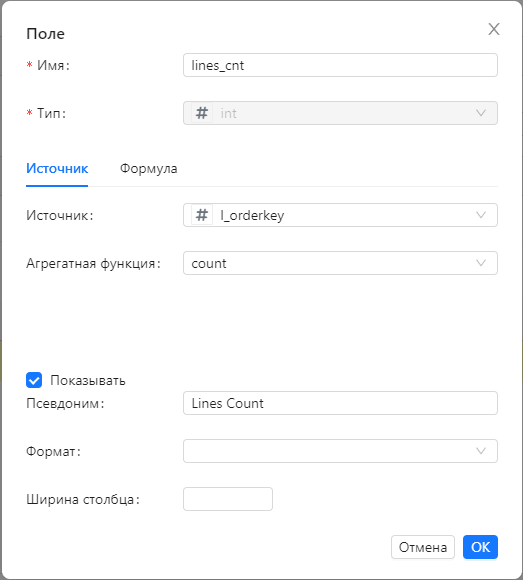
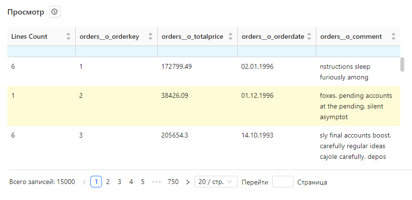
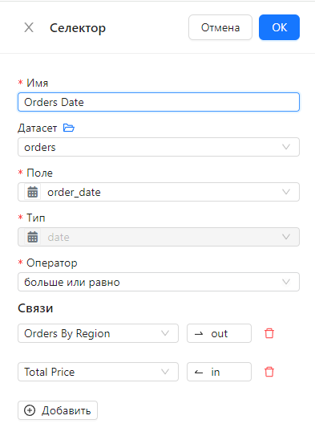
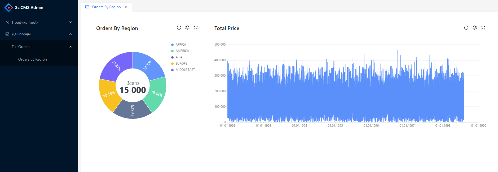

# Инструменты аналитики

## Источники данных

Для работы со сторонними БД требуется настроить соответствующие источники данных.
Создание источников данных описано в разделе [Управление сущностями](item_management.md).

## Датасеты

В SciCMS датасет соответствует таблице или произвольному SQL запросу в источнике данных.
Пункт меню для управления датасетами - **Анализ/Датасеты**.

### Создание датасета

При создании датасета нужно выбрать созданный ранее источник данных, либо по умолчанию будет использоваться источник данных `main`.
Также, как и сущность, датасет имеет необязательный параметр **TTL кэша (мин)** - время жизни кэша в минутах.
Если он не задан, то принимается значение по умолчанию, равное 5 минут (настраиваемый параметр - подробнее см. в [документации SciCMS Core](https://github.com/borisblack/scicms-core/blob/main/docs/ru/analytics.md "Инструменты аналитики")).
Если значение кэша меньше или равно 0, то записи в датасете не кэшируются. Кэш сбрасывается при каждом перезапуске приложения.

Чтоб работать с датасетом, требуется знать, какие таблицы содержатся в источнике данных, какова структура этих таблиц и какие записи они содержат.
Для получения этой информации служат вкладки: **Источники** и **Поля** в нижней части формы датасета.

### Управление источниками

Левая часть вкладки **Источники** содержит список таблиц и столбцов в виде дерева.
Здесь и далее в примерах используется источник данных на основе схемы [TPC-H](https://www.tpc.org/tpch) - БД, предназначенной для тестирования производительности SQL запросов.
Над списком имеется фильтр по схеме и имени таблицы. По умолчанию выводятся все таблицы текущей схемы пользователя.
Поиск таблиц осуществляется по частичному совпадению и не зависит от регистра.
Для корректного отображения списка таблиц необходимо, чтоб у пользователя, указанного в источнике данных, были права на получение информации о структуре БД.

Правая часть вкладки **Источники** разделена на две части: вверху находится область конструктора (актривируется флажком **Использовать конструктор**), внизу - редактор SQL запроса (при использовании конструктора доступен только для чтения).
Если активировать конструктор, то при перетаскивании таблиц в его область запрос будет строиться динамически.
Первая добавленная таблица будет основной таблицей к которой также перетаскиванием могут добавлятся другие (в этом случае генерируется оператор `JOIN`).

Для выбора параметров соединения необходимо щелкнуть на линии между таблицами.

В случае необходимости конструктор можно отключить и ввести SQL запрос вручную.

### Настройка полей

Вкладка **Поля** разделена по горизонтали на две части: вверху находится список полей источника, внизу - данные из источника.

Каждое поле имеет следующие свойства:
- **Имя** - имя поля;
- **Тип** - тип поля (подробнее о типах см. в [документации SciCMS Core](https://github.com/borisblack/scicms-core/blob/main/docs/ru/analytics.md "Инструменты аналитики"));
- **Источник** - имя реального поля в случае, если поле кастомное (см. ниже) и не задано свойство **Формула**;
- **Показывать** - некоторые столбцы могут исключаться из запроса; в этом случае данный флаг снимается;
- **Агрегатная функция** - имя агрегатной функции, может принимать значения `count`, `countd`, `sum`, `avg`, `min`, `max`; применимо только к кастомным полям;
- **Формула** - произвольное SQL выражение для выполнения более сложных агрегаций;
- **Формат** - формат значения поля для отображения в отчетах; может принимать значения `int`, `float`, `date`, `time`, `datetime`;
- **Псевдоним** - псевдоним поля для отображения в отчетах;
- **Ширина столбца** - ширина столбца для отображения в отчетах.

Поля, чьи имена помечены иконкой "замок", являются собственными полями источника данных и не могут быть отредактированы (за исключением свойств **Показывать**, **Формат**, **Псевдоним** и **Ширина столбца**).
Эти свойство могут редактироваться непосредственно в списке полей.

#### Кастомные поля

Датасет может содержать так называемые кастомные (виртуальные) поля, которые используются при построении аналитических запросов.
Кастомные поля создаются нажатием кнопки **Добавить** над списком полей. При этом открывается модальное окно редактирования поля.
Аналогичное окно открывается при клике в списке полей на свойствах **Имя**, **Источник**, **Агрегатная функция** и **Формула**.

При добавлении/изменении полей в нижней части вкладки **Поля** автоматически перестраивается отчет, содержащий выбраные поля.
Если при этом используются агрегатные функции, то группировка происходит только по полям, у которых выбран флаг **Показывать**.
Фильтры и пагинация настраиваются аналогично любым другим табличным спискам в системе.

Справа от заголовка **Просмотр** находится кнопка открытия статистики выполнения запроса на сервере.

## Дашборды

Дашборд представляет собой набор интерактивных элементов визуализации данных.
Пункт меню для управления дашбордами - **Анализ/Дашборды**.
Форма редактирования дашборда в нижней части содержит две вкладки: **Категории** и **Спецификация**.
На вкладке **Категории** можно выбрать категории, в которые будет входить дашборд.

Вкладка **Спецификация** содержит конструктор визуализаций дашборда.

## Даши

**Даш** - основной элемент визуализации данных на дашборде.
Для добавления даша необходимо выбрать в выпадающей кнопке **Добавить** пункт **Даш**.
В верхней части каждого даша справа имеются кнопки обновления, контекстное меню и раскрытия даша на весь экран.
Контекстное меню даша позволяет выполнять следующие действия:
- задать временные фильтры (которые сбрасываются при закрытии даша);
- открыть статистику выполнения запросов;
- открыть даш на редактирование;
- удалить даш.

В окне редактирования должен быть выбран датасет, а также тип и имя даша.
В настоящий момент доступно 13 типов дашей:
`area` - линейный график с заполнением;
`bar` - горизонтальная столбчатая диаграмма;
`bubble` - пузырьковая диаграмма;
`bubbleMap` - пузырьковая диаграмма в виде слоя карты;
`column` - вертикальная столбчатая диаграмма;
`dougnut` - круговая диаграмма с секторами и настраиваемым (внешним и внутренним) радиусом;
`line` - линейный график;
`pie` - круговая диаграмма с секторами и настраиваемым (внешним) радиусом;
`polarArea` - круговая диаграмма c секторами в полярных координатах;
`radar` - круговая диаграмма с заполнением в виде экрана радара;
`report` - табличный отчет;
`scatter` - пузырьковая диаграмма;
`statistic` - числовая/текстовая метка.

За счет [механизма расширений](extensions.md) могут быть добавлены другие типы дашей.

В зависимости от типа даша полям назначаются определенные роли (ось X, ось Y, серия, сортировка и т.д.).
Также имеется набор специфических (для конкретного типа даша) свойств (расположение легенды, автоповорот метки оси и т.д.).

Поле для ввода правил стилизации записей позволяет декларативным путем описать внешний вид элементов данных (цвет, шрифт, значки).
При наведении на значок вопроса рядом с заголовком поля появляется всплывающее окно с подсказкой по использованию правил.

Поддерживается гибкая фильтрация данных неограниченной вложенности.
При наведении на значок вопроса рядом с заголовком поля появляется всплывающее окно с подсказкой по доступным функциям, которые могут использоваться в фильтрах.

## Текст

Элемент **Текст** позволяет дополнить даш или группу дашей на дашборде одним общим заголовком, либо текстовым описанием.
Редактирование выполняется (аналогично дашу) из контектного меню.

Параметр **Заголовок** (если задан) позволяет выбрать уровень заголовка (H1 - H5).

## Селекторы

Элемент **Селектор** позволяет задать взаимосвязи между дашами на дашборде.
Например, при выборе точки на графике другой даш может быть отфильтрован по выбранному элементу.
Для этого селектор должен быть привязан к датасету.
Связи могут быть трех типов: `in` - входящая связь, `out` - исходящая связь и `both` - двусторонняя связь.
Кроме связей между дашами селектор сам по себе может выступать в роли фильтра для связанных с ним дашей.
Редактирование выполняется (аналогично дашу) из контектного меню.
Пример настройки селектора:

Все дашборды, на которые пользователь имеет разрешение **Read**, доступны на отдельной странице `/bi` (например, при локальной разработке полный адрес будет выглядеть так: `http://127.0.0.1:3000/bi`).

