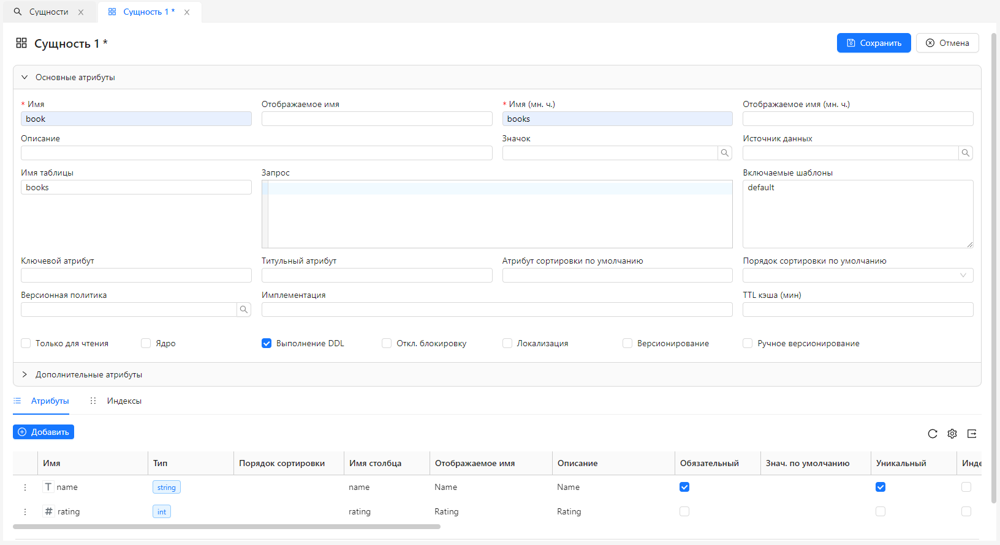

# Управление сущностями

Центральным понятием в SciCMS является **сущность** (Item).
В аналогии с объектно-ориентированным программированием сущность представляет собой класс (описание полей и методов), а запись для данной сущности - экземпляр класса (конкретные данные). Подробнее о сущностях и модели данных SciCMS см. в [документации SciCMS Core](https://github.com/borisblack/scicms-core/blob/main/docs/ru/data_model.md "Модель данных").

## Создание/редактирование/удаление

Для работы с сущностями необходимо выбрать пункт меню **Администрирование/Сущности**, откроется вкладка со списком имеющихся сущностей.
Для создания сущности необходимо во вкладке со спискам сущностей нажать кнопку **Создать**.
Например, для создания сущности `book` в форме редактирования требуется заполнить поля **Имя**, **Имя (мн. ч)**, **Имя таблицы** и добавить атрибуты `name` и `rating`:



Каждая сущность имеет необязательный параметр **TTL кэша (мин)** - время жизни кэша в минутах.
Если он не задан, то принимается значение по умолчанию, равное 10 минут (настраиваемый параметр, подробнее см. в [документации SciCMS Core](https://github.com/borisblack/scicms-core/blob/main/docs/ru/data_model.md "Модель данных").
Если значение кэша меньше или равно 0, то записи сущности не кэшируются.
Кэш работает только для операций чтения. При изменении/удалении сущности кэш обновляется.

После нажатия кнопки **Сохранить** необходимо выполнить повторный вход в приложение (будет выведено соответствующее диалоговое окно с предложением).

Для просмотра и редактирования сущности нужно на вкладке со списком дважды щелчнуть на выбранной строке.
Редактирование производится в три этапа: блокировка нажатием кнопки **Изменить**, собственно редактирование, и разблокировка нажатием кнопки **Сохранить**.
Это поведение установлено для всех сущностей в системе по умолчанию и может быть изменено, если на форме редактирования сущности включить флаг **Откл. блокировку**.
В этом случае будет только кнопка **Сохранить** и поля формы всегда будут доступны для изменения. Редактирование системных сущностей (с флагом `core` = `true`) запрещено.

Удаление можно производить либо из формы редактирования, либо на вкладке со списком через вызов контекстное меню сущности.

## Работа с табличным списком

Списки в SciCMS имеют инструменты для фильтрации, сортировки и пагинации. В верхней части таблицы находится строка с фильтрами для каждого столбца.
Фильтры объединяются по условию **И**. Принцип работы фильтров зависит от типа столбца:
- для строковых типов ищется частичное соответствие без учета регистра;
- для числовых типов производится буквальное сравнение;
- для булевого типа допустимые значения фильтра: `1`, `0`, `true`, `false`, `yes`, `no`, `y`, `n`;
- фильтр для типа `date` может принимать следующие форматы: `31.12.2023`, `2023-12-31` (фильтр по диапазону в 1 день); `12.2023`, `2023-12` (фильтр по диапазону в 1 месяц); `2023` (фильтр по диапазону в 1 год);
- фильтр для типа `time` может принимать следующие форматы: `23:59` (фильтр по диапазону в 1 минуту); `23` (фильтр по диапазону в 1 час);
- фильтр для типа `datetime` и `timestamp` может принимать следующие форматы: `31.12.2023 23:59`, `2023-12-31 23:59` (фильтр по диапазону в 1 минуту); `31.12.2023 23`, `2023-12-31 23` (фильтр по диапазону в 1 час); `31.12.2023`, `2023-12-31` (фильтр по диапазону в 1 день); `12.2023`, `2023-12` (фильтр по диапазону в 1 месяц); `2023` (фильтр по диапазону в 1 год);
- для связи типа `oneToOne` и `manyToOne` ищется частичное соответствие для титульного атрибута без учета регистра; титульный атрибут задается в поле `titleAttribute` сущности (если не задан, то используется идентификатор).

## Атрибуты сущностей

Система поддерживает следующие типы атрибутов:
- `uuid` - строка формата [UUID](https://en.wikipedia.org/wiki/Universally_unique_identifier); в форме отображается как строковое поле ввода с валидацией формата UUID;
- `string` - строка фиксированной длины; максимальная длина определяется полем `length` атрибута; в форме отображается как строковое поле ввода; в случае необходимости в дополнительной валидации можно задать параметр `pattern` - регулярное выражение, которому должна соответствовать строка;
- `text` - строка неограниченной длины; в форме отображается как многострочный раскрывающийся редактор; дополнительно может быть выставлен параметр `format` для посветки синтаксиса (в настоящий момент доступны значения `sql` и `javascript`);
- `enum` - строковое перечисление; для данного атрибута необходимо поле `enumSet` с перечнем допустимых значений; в форме отображается как раскрывающийся список значений для выбора;
- `sequence` - значение атрибута будет браться из последовательности; последовательность представляет собой отдельную сущность и включает такие атрибуты как начальное значение, префикс, суффикс, шаг, заполнитель, длина заполнения; для атрибута с типом `sequence` должен быть задан параметр `seqName`, который ссылается на имя существующей последовательности; в форме отображается как строковое поле ввода только для чтения, т.к. значение генерируется автоматически;
- `email` - строка адреса электронной почты; в форме отображается как строковое поле ввода с валидацией формата адреса;
- `password` - строка пароля, дополнительно может быть задано поле `encode` - для кодирования строки при сохранении в БД; в форме отображается как маскированное поле ввода;
- `int` - целочисленный тип, дополнительно могут быть заданы поля `minRange` и `maxRange`; в форме отображается как числовое поле ввода;
- `long` - длинный целочисленный тип, дополнительно могут быть заданы поля `minRange` и `maxRange`; в форме отображается как числовое поле ввода;
- `float` - числовой тип с плавающей точкой, дополнительно могут быть заданы поля `minRange` и `maxRange`; в форме отображается как числовое поле ввода;
- `double` - числовой тип с плавающей точкой двойной точности, дополнительно могут быть заданы поля `minRange` и `maxRange`; в форме отображается как числовое поле ввода;
- `decimal` - тип для десятичного числа, дополнительно могут быть заданы поля `minRange`, `maxRange`, `precision` и `scale`; в форме отображается как числовое поле ввода;
- `date` - тип для хранения даты; в форме отображается как поле ввода с всплывающим окном выбора даты;
- `time` - тип для хранения времени; в форме отображается как поле ввода с всплывающим окном выбора времени;
- `datetime` - тип для хранения даты и времени (предполагается хранение в поле информации о временной зоне, если данный механизм поддерживается СУБД); в форме отображается как поле ввода с всплывающим окном выбора даты и времени;
- `timestamp` - тип для хранения даты и времени; в форме отображается как поле ввода с всплывающим окном выбора даты и времени;
- `bool` - логический тип; в форме отображается в виде чекбокса;
- `array` - массив (список) значений; в форме отображается как поле textarea, где каждая запись массива находится в отдельной строке;
- `json` - JSON-объект; в форме отображается как многострочный раскрывающийся редактор с подстветкой синтаксиса;
- `media` - файл; в форме отображается как элемент управления для выгрузки файла;
- `relation` - связь с другой сущностью; связи типа `oneToOne` и `manyToOne` (см. ниже) отображаются как поле для выбора связанной записи в модальном окне;

Связи типа `oneToMany` и `manyToMany` отображаются отдельными вкладками в нижней части формы сущности.
Каждая из этих вкладок содержит таблицу связанных записей и элементы управления для их создания, просмотра, изменения, удаления.
Список также снабжен стандартными инструментами фильтрации, сортировки и пагинации.

Для настройки видимости, расположения и размера каждый атрибут имеет следующие поля:
- `colWidth` - ширина столбца в табличном представлении (в пикселах); значение по умолчанию - `140`;
- `colHidden` - флаг скрытия по умолчанию столбца в таблице; при этом столбец все-равно можно отобразить, если выбрать соответствующий ему чекбокс в меню **Настройки** в правой части панели инструментов таблицы;
- `fieldWidth` - ширина поле в форме (задается в шагах сетки, где размер сетки равен `24`); значение по умолчанию - `6` (четверть от ширины формы);
- `fieldHidden` - флаг скрытия поля в форме;
- `sortOrder` - порядок появления атрибута в форме/таблице.

Для любого атрибута любой сущности доступно определение собственного компонента формы (подробнее см. в разделе [Расширения](/docs/ru/extensions.md)).

## Связи

Существует четыре типа связей: `oneToOne`, `manyToOne`, `oneToMany` и `manyToMany`. Этот тип задается в поле `relType` атрибута.
Вторым обязательным параметром атрибута типа `relation` является `target` - имя сущности, с которой осуществляется связь.

### Связь oneToOne

Данный вид связи подразумевает, что в другой таблице существует единственная запись, на которую ссылается запись текущей сущности (атрибут с типом `relation` текущей сущности хранит идентификатор записи второй сущности).
В этом случае текущая сущность является "владельцем" связи. Сущности составляющие связь `oneToOne`, могут принадлежать разным источникам данных.
Атрибут связи первой сущности ссылается на атрибут второй сущности, который указывается в ее параметре **Ключевой атрибут** (по умолчанию - `id`).
Это поведение можно переопределить, если задать в атрибуте связи поле `referencedBy`.
Подробнее о связях см. в [документации SciCMS Core](https://github.com/borisblack/scicms-core/blob/main/docs/ru/data_model.md "Модель данных").

Связь `oneToOne` может быть и двусторонней.
Тогда вторая сущность также содержит виртуальную ссылку на текущую (без физического столбца таблицы, т.к. не является "владельцем" связи) с дополнительным параметром `mappedBy`.
Этот параметр содержит имя атрибута сущности-владельца, по которому построена связь.
При двусторонней связи сущность-владелец также должна содержать дополнительный параметр (называется `inversedBy`) на своей стороне.
Аналогично `mappedBy`, этот параметр содержит имя атрибута противоположной сущности, по которому построена связь.

### Связь manyToOne

Связь `manyToOne` подразумевает, что в другой таблице существует запись, на которую ссылаются записи текущей сущности.
Связь `manyToOne` всегда является "владеющей", т.е. хранит в столбце своего атрибута идентификатор записи второй сущности.
Сущности составляющие связь `manyToOne` и `oneToMany`, могут принадлежать разным источникам данных.
Также, аналогично `oneToOne`, можно переопределить идентификатор противоположной сущности, если добавить к атрибуту связи поле `referencedBy`.

### Связь oneToMany

Связь `manyToOne` можно сделать двусторонней.
Тогда вторая сущность будет содержать виртуальную ссылку типа `oneToMany` на список записей текущей сущности с дополнительным параметром `mappedBy`.
Этот параметр содержит имя атрибута сущности-владельца, по которому построена связь `manyToOne`.
При двусторонней связи сущность-владелец также должна содержать дополнительный параметр (называется `inversedBy`) на своей стороне.
Аналогично `mappedBy`, этот параметр содержит имя атрибута противоположной сущности, по которому построена связь `oneToMany`.

### Связь manyToMany

Связь `manyToMany` подразумевает, что на записи текущей сущности могут ссылаться записи второй сущности.
Обратное также верно: на записи второй сущности могут ссылаться записи текущей сущности.
Для моделирования такой связи в реляционной СУБД необходимо наличие промежуточной таблицы, в которой хранятся ссылки таблиц первой и второй сущностей друг на друга.
Исходя из этого требования, перед реализацией связи `manyToMany` нужно создать промежуточную сущность с двумя атрибутами `source` и `target` типа `relation` и значением `relType` = `manyToOne` (по одному для каждой из основных сущностей).
После этого можно создать связи `manyToMany` в каждой из основных сущностей, указав промежуточную связь в свойстве `intermediate` атрибута связи.
Если текущая сущность находится (в промежуточной сущности) в позиции `source`, то имя атрибута противоположной сущности указывается в свойстве `inversedBy`, если в позиции `target` - то в свойстве `mappedBy`.

Сущности составляющие связь `manyToMany`, не могут принадлежать разным источникам данных. Это ограничение обусловлено наличием промежуточной сущности.

## Версионирование

Для того чтобы сущность была версионной, необходимо при создании включить для нее флаг **Версионирование**.
Записи версионных сущностей не обновляются (всегда создаются новые версии):


За нумерацию версий отвечает поле **Основная версия**.
Оно может задаваться автоматически, либо вручную (если у сущности выставлен параметр **Ручное версионирование**).
При автоматической нумерации за присвоение следующей версии отвечает так называемая версионная политика.
Это отдельная сущность, которая определяет состав и порядок версий:


Также у каждой версионируемой записи имеется поле **Минорная версия**, оно опционально и может устанавливаться пользователем самостоятельно.

На вкладке просмотра/редактирования записи версионной сущности имеется кнопка **Версии** для просмотра списка всех существующих версий текущей записи.
Также кнопка **Удалить** превращается в выпадающее меню с вариантами удаления либо текущей версии, либо всех версий текущей записи.

## Мультиязычность

Для того чтобы сущность была мультиязычной, необходимо при создании включить для нее флаг **Локализация**.

Создание новой локализации выполняется из формы редактирования сущности, где в поле **Язык** нужно выбрать соответствующее значение.
Доступными значениями можно управлять из меню **Администрирование/Языки**.
После нажатия **Сохранить** будет создана локализация текущей записи.

## Меню приложения

Чтобы работать с вновь созданными сущностями, необходимо добавить их в меню приложения.
Для этого нужно либо отредактировать файл [src/config/menu.ts](src/config/menu.ts), либо добавить параметр конфигурации `menu` с типом `json` и аналогичным значением в виде JSON-объекта.
Управление параметрами конфигурации выполняется из меню **Администрирование/Параметры**.
Объект конфигурации меню с новыми категорией и сущностью `book` представлен ниже.
Каждый элемент списка `items` является либо выбираемым пунктом меню, либо категорией.
```javascript
const menuConfig: MenuConfig = {
  items: [{
    key: 'administration',
    label: 'Administration',
    icon: 'CrownOutlined',
    roles: [ROLE_ADMIN],
    children: [{
      itemName: 'property'
    }, {
      key: 'security',
      label: 'Security',
      icon: 'LockOutlined',
      roles: [ROLE_ADMIN],
      children: [{
        itemName: 'group'
      }, {
        itemName: 'user'
      }, {
        itemName: 'permission'
      }, {
        itemName: 'identity'
      }]
    }, {
      key: 'storage',
      label: 'Storage',
      icon: 'FaDatabase',
      roles: [ROLE_ADMIN],
      children: [{
        itemName: 'datasource'
      }, {
        itemName: 'media'
      }]
    }, {
      itemName: 'itemTemplate'
    }, {
      itemName: 'item'
    }]
  }, {
    key: 'analysis',
    label: 'Analysis',
    icon: 'PieChartOutlined',
    roles: [ROLE_ADMIN, ROLE_ANALYST],
    children: [{
      itemName: 'dataset'
    }, {
      itemName: 'dashboard'
    }, {
      itemName: 'dashboardCategory'
    }]
  }, {
    key: 'library',
    label: 'Library',
    children: [{
      itemName: 'book'
    }]
  }]
}
```

Выбираемый пункт меню содержит единственное поле `itemName` - имя сущности.
Действие при клике на пункте меню - открытие вкладки со списком записей для указанной сущности.
Содержимое страницы списка (как и многих других) также может быть переопределено через механизм [расширений](extensions.md).

Категория меню содержит следующие поля:
- `key` - уникальный строковый ключ категории;
- `label` - отоброжаемое имя категории (локализованная строка);
- `icon` - значок категории (необязательное поле);
- `roles` - роли, для которых доступна категория; подробнее о ролях см. в [документации SciCMS Core](https://github.com/borisblack/scicms-core/blob/main/docs/ru/security.md "Безопасность");
- `children` - дочерние категории/пункты.

После сохранения меню и обновления страницы оно должно выглядеть следующим образом:


При выборе пункта **Library/Books** откроется список сущностей со стандартным набором операций.

Настройка контроля доступа для сущностей описана в разделе [Безопасность](security.md).

## Источники данных

Архитектура SciCMS предполагает хранение метаданных (всей информации, необходимой для работы системы) в основной реляционной базе данных (встроенный источник данных `main`).
Для повышения производительности и обеспечения масштабируемости в облачном окружении метаданные кэшируются через [Redis](https://redis.io).

Остальные данные могут храниться как в основной, так и в любой другой БД.
Система позволяет подключать неограниченное число БД динамически в процессе работы.
При этом фактические подключения открываются только в момент обращения к базе, не расходуя ресурсы на простаивающие соединения.
При долгом простое (настраиваемый параметр) соединения закрываются, освобождая ресурсы системы (подробнее см. в [документации SciCMS Core](https://github.com/borisblack/scicms-core/blob/main/docs/ru/data_model.md "Модель данных")).

Пункт меню для управления источниками данных - **Администрирование/Хранилище/Источники данных**.
В форме редактирования имя пользователя и пароль можно указать напрямую, либо используя переменные окружения (как в примере ниже).


Несмотря на то, что пароль не может быть прочитан через внешний API, в БД SciCMS учетные данные источников данных хранятся в чистом виде (т.к. используются при открытии подключений).
Поэтому рекомендуется использовать именно второй способ (переменные окружения).
После создания, источник данных может быть выбран при создании любой сущности.
