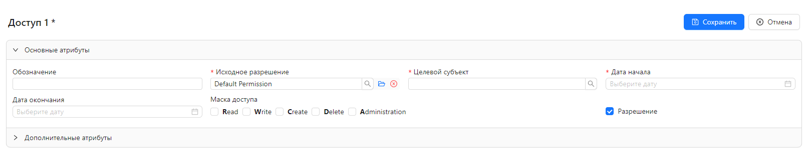

# Безопасность

Управление пользователями, группами и настройка контроля доступа осуществляется из меню **Администрирование/Безопасность**.

## Управление пользователями

### Изменение пароля

После первого входа пароль локального пользователя может быть изменен. Для этого необходимо выбрать пункт меню **Профиль(<имя_пользователя>)/Сменить пароль**.
В появившемся диалоговом окне нужно ввести старый пароль, новый пароль с подтверждением и нажать **ОК**.

### Создание нового пользователя

Пункт меню для управления пользователями - **Администрирование/Безопасность/Пользователи**.
В открывшейся вкладке со списком пользователей нужно в верхней части справа нажать кнопку **Создать**.
Затем в появившейся вкладке ввести имя пользователя, пароль с подтверждением и нажать **Сохранить**.
Для включения/отключения учетной записи пользователя служит флаг **Включить**.
Редактирование и удаление существующих пользователей выполняется также, как и аналогичные операции для любых других сущностей (см. раздел [Управление сущностями](item_management.md)).

## Роли и группы

Роли могут назначаться как непосредственно пользователю, так и группе.

### Создание роли

Для добавления роли пользователю необходимо в форме просмотра/редактирования пользователя нажать кнопку **Изменить**, затем на вкладке со списком ролей нажать **Добавить**.
Откроется вкладка, где нужно ввести имя создаваемой роли и нажать **Сохранить**. По соглашению имя роли пишется латиницей прописными буквами с префиксом `ROLE_`.

### Создание группы

Пункт меню для управления группами - **Администрирование/Безопасность/Группы**.
В открывшейся вкладке со списком групп нужно в верхней части справа нажать кнопку **Создать**.
Затем в появившейся вкладке ввести имя группы и нажать **Сохранить**.

### Создание роли группы

Процесс добавления роли группе такой же, как и добавление роли пользователю.
Необходимо в форме просмотра/редактирования группы нажать кнопку **Изменить**, затем на вкладке со списком ролей нажать **Добавить**.
Откроется вкладка, где нужно ввести имя создаваемой роли и нажать **Сохранить**.

### Добавление пользователя в группу

Для добавления участника группы необходимо в форме просмотра/редактирования группы нажать кнопку **Изменить**, затем на вкладке со **Участники** нажать **Добавить**.
Откроется вкладка, где нужно выбрать пользователя из списка и нажать **Сохранить**.

## Разрешения и доступы

После создания пользователей и назначения им необходимых ролей, можно назначать им доступы.
Механизм контроля доступа в SciCMS основан на понятии "разрешение" ("permission").
Каждая сущность имеет поле **Разрешение** - ссылку на запись сущности `permission`, содержащую информацию о доступах.
Для любой сущности может быть задано разрешение по умолчанию, используемое для всех новых записей данного типа.
Если разрешение по умолчанию не задано, то будет использовано глобальное разрешение по умолчанию **Default Permission**.

## Предоставление доступа пользователю/группе к записи

Процесс предоставления доступа выглядит следующим образом.

### 1. Создать разрешение (если оно еще не создано)

Управление разрешениями осуществляется через пункт меню **Администрирование/Разрешения**.
В форме редактирования разрешения необходимо заполнить единственное поле **Имя** и нажать **Сохранить**.

### 2. Создать субъект безопасности - identity (если еще не создан)

Субъект безопасностя является обобщение пользователя/роли, которым предоставляется доступ.
Управление субъектами осуществляется через пункт меню **Администрирование/Субъекты**.
В форме редактирования субъекта необходимо заполнить поле **Имя**, оно должно в точности совпадать с существующим именем пользователя или роли.
Если имя является именем пользователя, то нужно включить флаг **Пользователь**.
Если же субъект является ролью, то флаг должен быть выключен. После сохранения субъекта безопасности можно переходить к настройкам доступа.

### 3. Добавить доступ

Настраивать доступы можно либо из формы редактирования разрешения, либо из формы редактирования субъкта - обе формы имеют вкладку **Доступы**.
Если в этой вкладке нажать кнопку **Добавить**, то откроется вкладка редактирования доступа:

Форма доступа содержит следующие поля:
- **Обозначение** - произвольное название доступа;
- **Исходное разрешение** - поле выбора разрешения;
- **Целевой субъект** - поле выбора (созданного) субъекта безопасности;
- **Дата начала** - дата начала действия доступа;
- **Дата окончания** - дата окончания действия доступа (если не указана, то доступ бессрочный);
- **Маска доступа** - флаги с возможными типами доступа (**Administration**, **Delete**, **Create**, **Write**, **Read**);
- **Разрешение** - флаг, определяющий, является ли разрешение дающим доступ или, наоборот, запрещающим доступ; запрещающий доступ имеет более высокий приоритет, чем разрешающий.

Тип доступа **Administration** позволяет изменять разрешение для записи.
При этом выбранное разрешение должно входить в список доступных разрешений для сущности.

Для достижения наибольшей гибкости управления доступом рекомендуется использовать роли групп и назначать отдельные разрешения для каждой (небольшой) функциональной подсистемы (например, отдел расчета, клиентские менеджеры, менеджеры продаж, руководство и т.д.).
Тогда для каждой роли мы сможем добавлять разрешения с необходимым доступом.
Чем меньше функциональная подсистема, тем гибче и детальнее выполняется настройка доступа.
