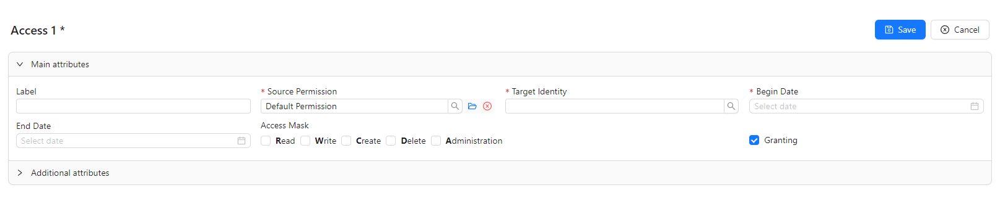

# Security

Managing users, groups and setting up access control is carried out from the **Administration/Security** menu.

## User management

### Changing Password

After the first login, the local user's password can be changed. To do this, select the menu item **Profile(<username>)/Change password**.
In the dialog box that appears, you need to enter the old password, the new password with confirmation and click **OK**.

### Creating a new user

The menu item for managing users is **Administration/Security/Users**.
In the tab that opens with a list of users, we need to click the **Create** button in the upper right part.
Then in the tab that appears, enter username, password with confirmation and click **Save**.
To enable/disable a user account, use the **Enabled** flag.
Editing and deleting existing users is performed in the same way as similar operations for any other Items (see the [Items Management](item_management.md) section).

## Roles and groups

Roles can be assigned directly to a user or to a group.

### Creating a role

To add a role, the we must click the **Edit** button in the user view/edit form, then click **Add** on the tab with the list of roles.
A tab will open where we need to enter the name of the role to be created and click **Save**. By convention, the role name is written in Latin capital letters with the prefix `ROLE_`.

### Creating a group

The menu item for managing groups is **Administration/Security/Groups**.
In the tab that opens with a list of groups, we need to click the **Add** button in the upper right part.
Then in the tab that appears, enter the group name and click **Save**.

### Creating a group role

The process of adding a role to a group is the same as adding a role to a user.
We must click the **Edit** button in the group viewing/editing form, then click **Add** on the tab with the list of roles.
A tab will open where we need to enter the name of the role to be created and click **Save**.

### Adding a user to a group

To add a group member, in the group viewing/editing form, click the **Edit** button, then on the **Members** tab, click **Add**.
A tab will open where we need to select a user from the list and click **Save**.

## Permissions and access

After creating users and assigning them the necessary roles, we can assign them access.
The access control mechanism in SciCMS is based on the concept of "permission".
Each Item has a **Permission** field - a relation to the `permission` Item record containing information about access.
Any Item can have a default permission that is used for all new records of that type.
If no default permission is specified, the global **Default Permission** will be used.

## Granting user/group access to a record

The process for granting access is as follows.

### 1. Create a permission (if not already created)

Permissions are managed through the menu item **Administration/Permissions**.
In the permission editing form, we must fill in the only field **Name** and click **Save**.

### 2. Create a security identity (if not already created)

A security identity is a generalization of the user/role to which access is granted.
Identities are managed through the menu item **Administration/Identities**.
In the identity editing form, we must fill in the **Name** field; it must exactly match the existing user or role name.
If the name is a username, then we need to enable the **Principal** flag.
If the identity is a role, then the flag should be turned off. After saving the security identity, we can proceed to the access settings.

### 3. Add access

We can configure access either from the permission editing form or from the subject editing form - both forms have an **Accesses** tab.
If you click the **Add** button in this tab, the access editing tab will open:

The access form contains the following fields:
- **Label** - arbitrary access name;
- **Source Permission** - permission selection field;
- **Target Identity** - field for selecting a (created) security identity;
- **Begin Date** - begin date of access;
- **End Date** - expiration date of access (if not specified, access is perpetual);
- **Access Mask** - flags with possible access types (**Administration**, **Delete**, **Create**, **Write**, **Read**);
- **Granting** - a flag that determines whether the permission grants access or, conversely, denies access; denying access has higher priority than allowing access.

The **Administration** access type allows us to change the record permission.
In this case, the selected permission must be included in the list of available permissions for the Шеуь.

To achieve the greatest flexibility in access control, it is recommended to use group roles and assign separate permissions for each (small) functional subsystem (for example, billing department, client managers, sales managers, management, etc.).
Then for each role we can add permissions with the necessary access.
The smaller the functional subsystem, the more flexible and detailed the access settings are.
